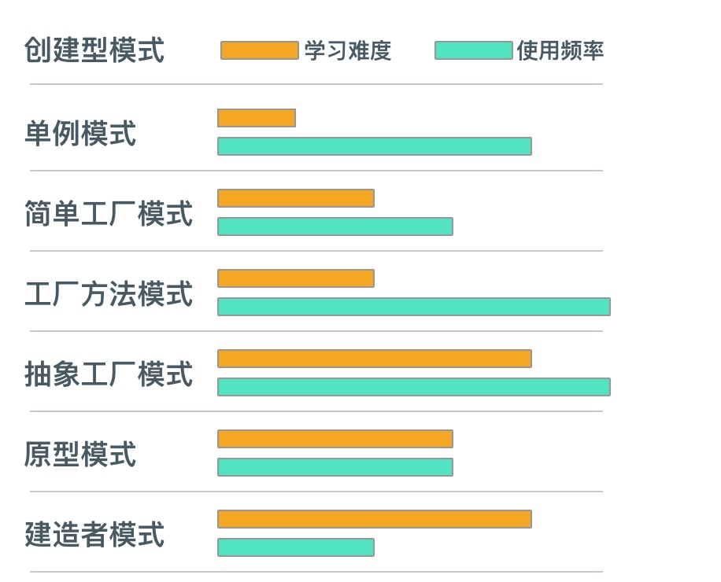
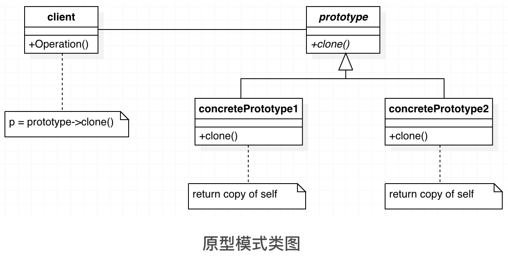

# Head First 面向对象与设计模式 （四）

## 一、原型模式

* 例子1：
    
    > 孙悟空拔下一嘬猴毛，轻轻一吹就会变出好多的孙悟空来。

* 例子2：

    > 寄个快递 - 下面是一个邮寄快递的场景：
    > “给我寄个快递。”顾客说。
    > “寄往什么地方？寄给……？”你问。
    > “和上次差不多一样，只是邮寄给另外一个地址，这里是邮寄地址……”顾客一边说一边把写有邮寄地址的纸条给你。
    > “好！”你愉快地答应，因为你保存了用户的以前邮寄信息，只要复制这些数据，然后通过简单的修改就可以快速地创建新的快递数据了。
    



### 1.1 概念

**原型模式（Prototype Pattern）**：与工厂模式类似，都是用来创建对象的。利用**克隆**来生成一个大对象，减少创建时的初始化等操作占用开销

### 1.2 问题

当对象的构造函数非常复杂，在生成新对象的时候非常耗时间、耗资源的情况？我们是怎么来创建呢？

### 1.3 解决方案

通过**复制（克隆、拷贝）**一个指定类型的对象来创建更多同类型的对象。

这个指定的对象可被称为**“原型”对象**，也就是通过复制原型对象来得到更多同类型的对象。

在php的很多模板库，都用到clone。如smarty等。

### 1.4 适用性

原型模式的**主要思想**：是**基于现有的对象克隆一个新的对象**出来，一般是有对象的内部提供克隆的方法，通过该方法返回一个对象的副本。

这种创建对象的方式，相比我们之前说的几类创建型模式还是有区别的，之前的讲述的工厂模式与抽象工厂都是通过工厂封装具体的new操作的过程，返回一个新的对象。

有的时候我们通过这样的创建工厂创建对象不值得，特别是以下的几个场景的时候，可能使用原型模式更简单也效率更高。

* 当一个系统应该独立于它的产品创建、构成和表示时，要使用 Prototype 模式
* 当要实例化的类是在运行时刻指定时，例如，通过动态装载；
* 为了避免创建一个与产品类层次平行的工厂类层次时
* 当一个类的实例只能有几个不同状态组合中的一种时。建立相应数目的原型并克隆它们可能比每次用合适的状态手工实例化该类更方便一些。（也就是当我们在处理一些对象比较简单，并且对象之间的区别很小，可能只是很固定的几个属性不同的时候，可能我们使用原型模式更合适）。

### 1.5 结构



* Prototype：声明一个克隆自身的接口。
* ConcretePrototype：实现一个克隆自身的操作。
* Client：让一个原型克隆自身从而创建一个新的对象。

### 1.6 效果

Prototype 模式有许多和 Abstract Factory 模式 和 Builder 模式一样的效果：它对客户隐藏了具体的产品类，因此减少了客户知道的名字的数目。此外，这些模式使客户无需改变即可使用与特定应用相关的类。

#### 1.6.1 优点

1. 可以在运行时刻增加和删除产品
2. 可以改变值以指定新对象
3. 可以改变结构以指定新对象
4. 减少子类的构造
5. 用类动态配置应用

#### 1.6.2 缺点

Prototype模式的最主要缺点就是每一个类必须配备一个克隆方法。
而且这个克隆方法需要对类的功能进行通盘考虑，这对全新的类来说不是很难，但对已有的类进行改造时，不一定是件容易的事。

### 1.7 实例

利用原型模式优化批量发送短信

```php
// 原型模式
interface smsPrototype {
	public function copy();
}

// 具体原型
class concrateSmsPrototype implements smsPrototype {
	private $mobile;
	private $content;
	public function __construct($content) {
	
		$this->mobile = $mobile;
		$this->content = $content;
	}
	
	public function setMobile($mobile) {
		$this->mobile = $mobile;
	}
	
	public  function getMobile() {
		return $this->mobile;
	}
	
	public function setContent($content) {
		$this->content = $content;
	}
	
	public function getContent() {
		return $this->content;
	}
	
	public function copy() {
		return $this; // 浅拷贝
		return clone $this; // 深拷贝
	}

	public function sendSms() {
		echo '发送到：'.$this->mobile.' 的信息：'.$this->content.' 已经成功！';
	}
}
```

## 二、扩展

### 2.1 `=` 直接复制

    见代码 ch4/4_3.php

```php
class person {}
$p1 = new person();
$p2 = $p1; // `$p1` 和 `$p2` 指向同一个对象
```

* 在PHP中，对象的赋值和传递都是通过引用进行的。
* `$p1` 和 `$p2` 都只是指向同一个对象的引用，而没有各自保留一份相同的副本
* 任何一个对象都会同时修改另外一个对象

### 2.1 `clone`复制

> 如果想要获得一个对象的副本，而不是引用，可以使用 `clone` 关键字

    见代码 ch4/4_4.php

```php
class person{
    public $name;
}
$p1 = new person();
$p1->name = "少爷";

$p2 = clone $p1;
$p2->name = "弯弯";

var_dump($p1);
var_dump($p2);

// 结果
object(person)#1 (1) {["name"] => string(8) "少爷"}
object(person)#2 (1) {["name"] => string(4) "弯弯"}
```

`clone` 的方式实际上是对整个对象的内存区域，进行了一次复制并用新的对象变量指向新的内存，因此赋值后的对象和源对象之间基本上说是独立的。


### 2.1 浅拷贝

> 赋值时，引用赋值，相当于取了一个别名。对其中一个修改，会影响另一个

PHP中的对象拷贝采用的是浅拷贝的方法，如果对象里的属性成员本身就是引用类型的，`clone` 以后这些成员并没有真正被复制，仍然是引用。

* 浅复制可以保证所有基本数据类型的属性被完全复制
* 在复制对象属性时，只复制引用，并不复制引用的对象

    见代码 ch4/4_5.php

```php
class address {
	public $palace;
}
class person{
	public $name;
	public $address;
}
	
$address = new address();
$address->palace = "山东";

$p1 = new person();
$p1->name = "少爷";
$p1->address = $address; // 引用类型的赋值
	
$p2 = clone $p1;

echo "修改前：". "\n";
echo "p1 name = ".$p1->name." p1 palace = ".$p1->address->palace. "\n";
echo "p2 name = ".$p2->name." p2 palace = ".$p2->address->palace. "\n";

	
$p2->address->palace = "河北"; // 引用类型的赋值
$p2->name = "弯弯";

echo "修改后：". "\n";
echo "p1 name = ".$p1->name." p1 palace = ".$p1->address->palace. "\n";
echo "p2 name = ".$p2->name." p2 palace = ".$p2->address->palace. "\n";

// 结果
修改前：
p1 name = 少爷 p1 palace = 山东
p2 name = 少爷 p2 palace = 山东
修改后：
p1 name = 少爷 p1 palace = 河北
p2 name = 弯弯 p2 palace = 河北
```

针对以上问题，解决方案有两种

1. 添加 `address` 的对象拷贝

    `$p2->address = clone $p1->address;`
2. 采用深拷贝方式

### 2.1 深拷贝

> 赋值时值完全复制，完全的copy，对其中一个作出改变，不会影响另一个

```php
// 将如下代码放到 Person 类中
public function __clone(){
    $this->address = clone $this->address; //深拷贝的引用;
}

// 结果
修改前：
p1 name = 少爷 p1 palace = 山东
p2 name = 少爷 p2 palace = 山东
修改后：
p1 name = 少爷 p1 palace = 山东
p2 name = 弯弯 p2 palace = 河北

```

当在一个 `person` 对象上调用 `clone` 时，产生一个新的副本，并且新副本的 `__clone()` 方法会被调用。

即在 `__clone()` 方法中重新赋值会生效

* 完全复制一个对象
* `__clone()` 方法可以控制复制的内容
* 当一个对象上调用 `clone` 关键字的时候，其 `__clone()` 方法会被自动调用
* 实现 `__clone()` 方式时，需注意执行的环境， `__clone()` 是在复制得到的对象上运行的，而不是在原始对象上运行

利用 `__clone()` 方法控制复制的内容

```php
class Person {
    private $name;
    private $age;
    private $id;
    public function __construct(string $name, int $age) {
        $this->name = $name;
        $this->age = $age;
    }
    public function setId(int $id) {
        $this->id = $id;
    }
    public function __clone() {
        $this->id = 0;
    }
}

$person = new Person("bob", 44);
$person->setId(343);
$person2 = clone $person;

// person2 结果如下
name: bob
age: 44
id: 0
```


## 三、参考

* [PHP浅拷贝和深拷贝分析](http://jianwl.com/2016/05/03/PHP%E6%B5%85%E6%8B%B7%E8%B4%9D%E5%92%8C%E6%B7%B1%E6%8B%B7%E8%B4%9D%E5%88%86%E6%9E%90/)

